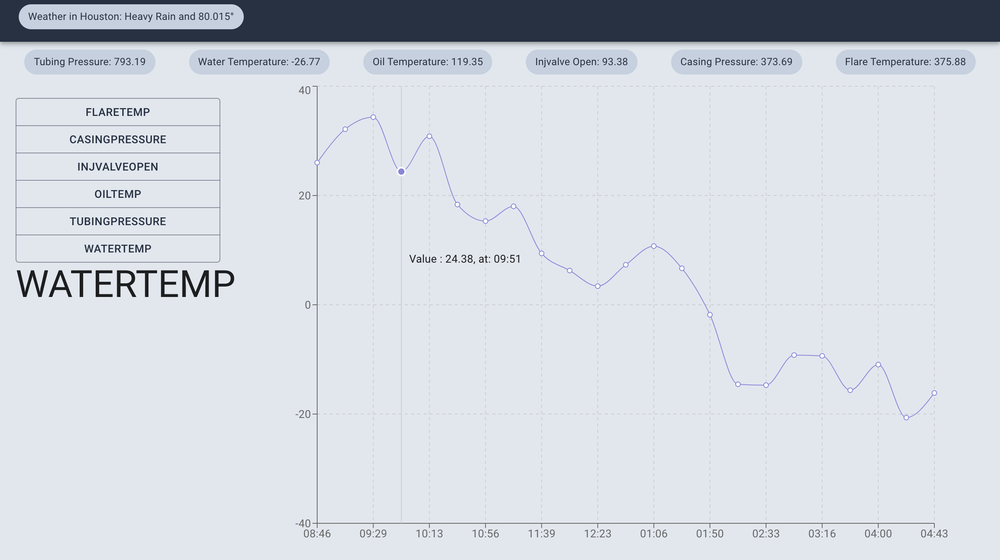

## Create React App Visualization

This assessment was bespoke handcrafted for Peter Egwurube.

This is a very interesting assessment,
as much as i learned along the way it also spiked my interest and love for react and graphQl.

The app was built with:

- [React](https://reactjs.org/) - JavaScript front end framework
- [Redux](https://redux.js.org/) - Javascript state management Library
- [Redux Sagas](https://redux-saga.js.org/) - Redux side effects library for asynchronous tasks
- [Chart.JS](https://www.chartjs.org/) - Javascript chart visualization library

For a list of specific libraries and versions please look inside of the package.json. Project scaffold was created by EOG's version of [create-react-app](https://github.com/facebook/create-react-app).
